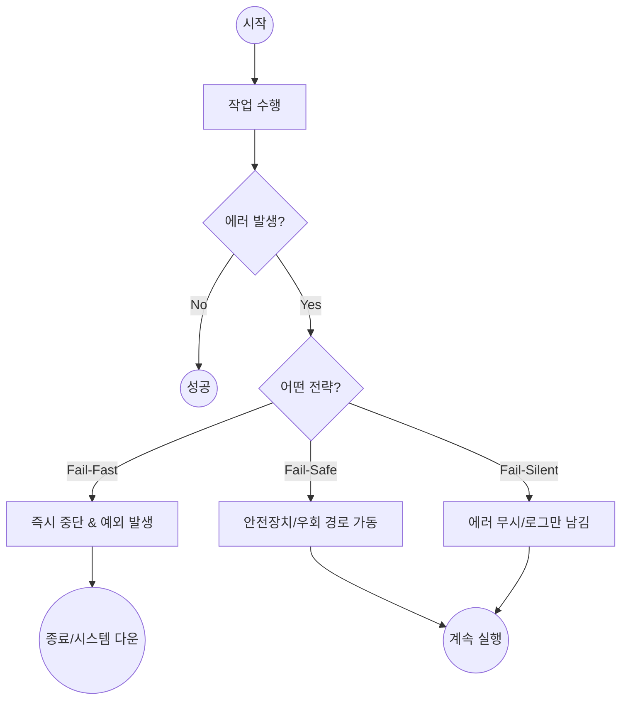

import ErrorHandlingImg from '@site/static/img/error_handling_strategies.png';

# 상세 설계 및 코딩 원칙

이 문서는 아키텍처보다 작은 단위인 **미시적(Micro) 설계**와 **코드 품질**에 대한 내용을 다룹니다. 정보처리기사 실기(프로그래밍 언어 활용, 애플리케이션 테스트) 및 기술 면접에서 자주 등장하는 핵심 주제입니다.

## 1. 에러 처리 전략 (Error Handling Strategy)
시스템이 오류 상황에 직면했을 때 어떻게 반응할지를 결정하는 전략입니다. 학부생 수준에서는 단순히 "에러를 잡는다(Catch)"를 넘어, **"시스템의 목적에 따라 어떻게 실패할 것인가?"**를 설계하는 관점을 가지는 것이 중요합니다.

### 🧭 한눈에 보는 흐름 (Diagram)

<div style={{ textAlign: 'center', margin: '2rem 0' }}>
  
</div>



---

### 1) Fail-Fast (빠른 실패)
문제가 발생하면 그 즉시 처리를 중단하고 에러를 보고합니다.
> **"상처가 곪기 전에 발견해서 치료하자"**

*   **동작**: 조건이 맞지 않거나 오류가 감지되면 즉시 `Exception`을 던집니다.
*   **장점 (Pros)**:
    *   **디버깅 용이**: 에러 발생 지점과 원인이 명확합니다.
    *   **데이터 무결성 보장**: 잘못된 상태로 시스템이 계속 돌아가서 데이터가 꼬이는 것을 막습니다.
*   **단점 (Cons)**:
    *   **가용성 저하**: 작은 오류에도 시스템 전체가 멈출 수 있어 사용자가 불편해할 수 있습니다.
*   **사용 예시**: 금융 거래, 결제 로직, 컴파일러 등 정확성이 최우선인 곳.

```java
// 예시: 송금 기능 (Fail-Fast)
public void transfer(int amount) {
    if (amount <= 0) {
        throw new IllegalArgumentException("이체 금액은 0보다 커야 합니다."); // 즉시 실패!
    }
    // ... 송금 로직 ...
}
```

### 2) Fail-Safe (안전한 실패)
문제가 발생해도 시스템을 죽이지 않고, 예비 작동(우회)을 통해 기능을 계속 수행합니다.
> **"이가 없으면 잇몸으로라도 씹자"**

*   **동작**: 에러가 나면 `Catch`하여 대체 값(Fallback)을 반환하거나, 보조 시스템을 가동합니다.
*   **장점 (Pros)**:
    *   **높은 가용성**: 시스템이 멈추지 않고 계속 돌아갑니다. 사용자 경험(UX) 측면에서 좋습니다.
*   **단점 (Cons)**:
    *   **좀비 프로세스**: 시스템이 죽지는 않았지만, 내부적으로는 병든 상태일 수 있어 나중에 원인을 찾기 힘듭니다.
    *   **디버깅 어려움**: 에러를 숨기고 넘어가므로 개발자가 문제를 인지하지 못할 수 있습니다.
*   **사용 예시**: 넷플릭스 추천 시스템(추천 서버 죽으면 인기 순위 보여줌), 구글 검색(일부 서버 죽어도 검색 결과 보여줌), 항공기 엔진 제어.

```java
// 예시: 추천 목록 가져오기 (Fail-Safe)
public List<String> getRecommendations(User user) {
    try {
        return recommendService.getFor(user); // 메인 로직 시도
    } catch (Exception e) {
        System.out.println("추천 서버 오류: " + e.getMessage()); // 로그 남기고
        return getPopularItems(); // 대체: 인기 상품 목록 반환 (죽지 않고 동작)
    }
}
```

### 3) Fail-Silent (조용한 실패)
오류가 발생해도 아무 일도 없었던 것처럼 조용히 넘어갑니다.
> **"모르는 게 약이다"**

*   **동작**: 에러를 `Catch`하고 아무것도 하지 않거나(Empty Catch Block), 기본값(`null` or `0`)을 반환합니다.
*   **장점 (Pros)**:
    *   주요 기능에 영향을 주지 않고 부가적인 기능을 처리할 때 유용합니다.
*   **단점 (Cons)**:
    *   **위험함**: 안티 패턴(Anti-Pattern)이 될 가능성이 높습니다. 왜 실패했는지 영원히 모를 수 있습니다.
*   **사용 예시**: UI의 '좋아요' 애니메이션 실패, 로그 수집 서버 전송 실패(로그 못 남겼다고 메인 로직을 죽이면 안 되니까).

```java
// 예시: 로그 전송 (Fail-Silent)
public void sendLog(String msg) {
    try {
        logServer.send(msg);
    } catch (Exception e) {
        // 로그 서버가 죽었다고 해서 프로그램이 멈추면 안 됨.
        // 그냥 조용히 넘어감 (혹은 로컬 파일에만 씀).
    }
}
```

### 📊 전략 비교 요약

| 특징 | Fail-Fast | Fail-Safe | Fail-Silent |
| :--- | :--- | :--- | :--- |
| **핵심 가치** | **정확성 & 무결성** | **가용성 & 생존** | **편의성 & 부가기능** |
| **실패 시** | 즉시 중단 (Error) | 대체 경로 실행 (Fallback) | 무시 (Ignore) |
| **디버깅** | 쉬움 (바로 터짐) | 어려움 (숨겨짐) | 매우 어려움 |
| **추천 상황** | 핵심 비즈니스 로직,<br/>API 유효성 검사 | UI 렌더링, 외부 API 연동,<br/>대규모 분산 시스템 | 로깅, 알림, 장식용 기능 |

## 2. 코딩 패턴 및 관용구 (Coding Patterns)

복잡한 로직을 단순화하고 가독성을 높여 유지보수하기 쉬운 코드를 만드는 기법들입니다.

### 1) 가드 절 (Guard Clause) & 조기 반환 (Early Return)
중첩된 `if-else` 블록(일명 '화살표 코드')을 피하기 위해, 예외적인 케이스를 함수 초입에서 **검사(Guard)**하고 **즉시 반환(Return)**하는 기법입니다.

:::tip[코드 비교: 중첩문 vs 가드 절]
<div style={{ display: 'flex', gap: '20px', alignItems: 'flex-start' }}>
<div style={{ flex: 1 }}>

**중첩된 조건문 (Nested)**
```java
public void processPayment(User user) {
    if (user != null) {
        if (user.isActive()) {
            if (user.hasBalance()) {
                // 핵심 로직이 깊숙이 숨어있음 😱
                pay(user);
            }
        }
    }
}
```
</div>

<div style={{ flex: 1 }}>

**가드 절 (Guard Clause)**
```java
public void processPayment(User user) {
    // 1. 가드: 빈 객체 검사
    if (user == null) return;
    
    // 2. 가드: 상태 검사
    if (!user.isActive()) return;

    // 3. 가드: 잔액 검사
    if (!user.hasBalance()) return;

    // 4. 핵심 로직: 맨 아래에 평탄하게 위치
    pay(user);
}
```
</div>
</div>
:::

### 2) 방어적 프로그래밍 (Defensive Programming)
**"모든 입력은 악의적이거나 잘못될 수 있다"**는 전제 하에, 예상치 못한 상황에서도 소프트웨어가 붕괴되지 않도록 검증 코드를 촘촘히 작성하는 것입니다.

*   **Null 체크**: `Objects.requireNonNull()`, `Optional` 활용
*   **유효성 검사**: 파라미터 값 범위 확인 (`age < 0` 등)
*   **불변성 유지**: 생성자 복사, `UnmodifiableList` 반환 등으로 외부의 변경 시도 차단

## 3. 소프트웨어 설계 원칙
객체지향 설계 원칙(SOLID) 외에 실무적으로 자주 인용되는 3대 원칙입니다.

### DRY (Don't Repeat Yourself)
*   **의미**: "같은 코드를 반복하지 마라."
*   **실천**: 중복되는 로직은 함수나 클래스로 분리하여 재사용합니다. 유지보수 시 한 곳만 수정하면 되므로 안전합니다.

### KISS (Keep It Simple, Stupid)
*   **의미**: "단순하게 만들어라, 바보야." (직설적이지만 강력한 원칙)
*   **실천**: 불필요한 복잡도를 줄이고, 누구나 이해할 수 있는 직관적인 코드를 작성합니다. 오버 엔지니어링을 경계합니다.

### YAGNI (You Ain't Gonna Need It)
*   **의미**: "그건 필요 없을 거야."
*   **실천**: **"나중에 쓸 것 같아서"** 미리 개발하지 마십시오. 현재 요구사항에만 집중하고, 필요한 시점에 구현합니다.
